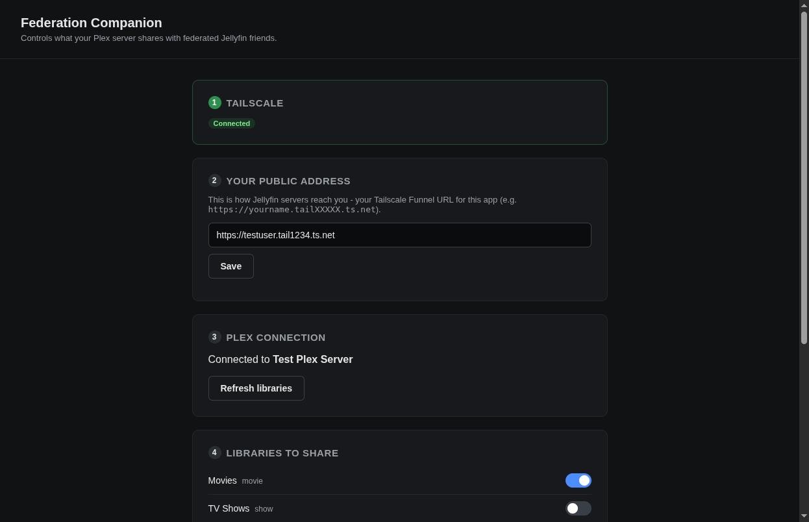
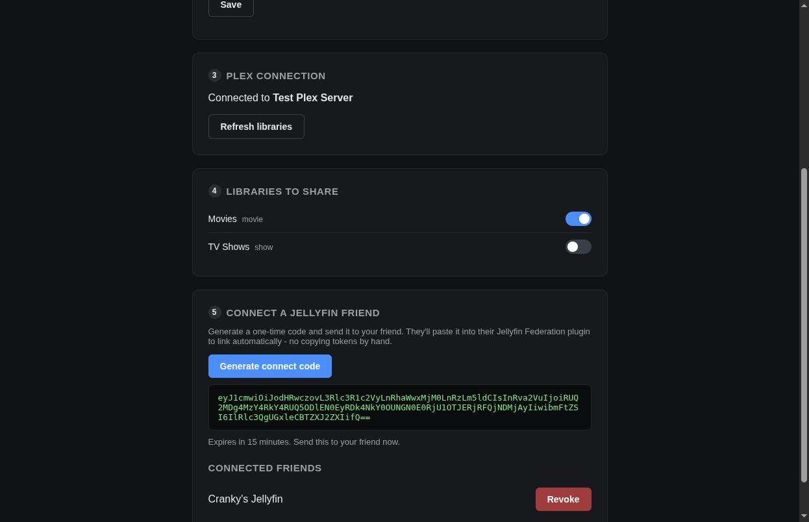

# Federation Companion

A standalone app a Plex-owning friend runs on their own machine to control what they share with federated Jellyfin servers - no Jellyfin required on their end.

Unlike the original setup (a Jellyfin admin manually enters the friend's raw Plex token into the Federation plugin), this app lets the Plex owner sign in themselves, expose their server over the internet via Tailscale, pick which libraries to share, and generate a one-time connect code that links a Jellyfin friend's Federation plugin automatically - no tokens copied by hand.

## Install

**macOS / Linux:**

```bash
curl -fsSL https://raw.githubusercontent.com/Saintdoggie/JellyfinFederationPlugin/master/Companion/install.sh | bash
```

**Windows (PowerShell):**

```powershell
irm https://raw.githubusercontent.com/Saintdoggie/JellyfinFederationPlugin/master/Companion/install.ps1 | iex
```

Either command downloads a self-contained build (no separate .NET install needed), unpacks it to `~/FederationCompanion` (or `%USERPROFILE%\FederationCompanion` on Windows), and starts it. It prints a local URL - open that in a browser to continue.

To run from source instead:

```bash
cd Companion
dotnet run
```

Then open the printed local URL (defaults to an ASP.NET Core-assigned port; set `ASPNETCORE_URLS` to pin one, e.g. `ASPNETCORE_URLS=http://127.0.0.1:7890 dotnet run`).

State (Plex token, server address, public URL, library sharing choices, connected peers) is stored in `companion-state.json` next to the executable - delete it to fully reset/sign out.

## Walkthrough

The app is a single page, worked top to bottom:

**1. Tailscale.** The app checks whether Tailscale is installed and signed in on this machine, and shows the exact command to run if not (`winget`/`brew`/`curl` depending on OS). It never runs anything on your behalf here - Tailscale changes network configuration, so you review and run the command yourself.



**2. Public address.** Once Tailscale is up, turn on [Funnel](https://tailscale.com/kb/1223/funnel) for this server and paste the resulting `https://...ts.net` address here. This is the address a federated Jellyfin server will actually call.

**3. Plex connection.** Sign in with your Plex account (opens Plex's own sign-in page - your password never touches this app) and it resolves your server automatically.

**4. Libraries to share.** Toggle which of your Plex libraries are visible to federated friends. Off by default; re-scanning never resets a choice you've already made.

**5. Connect a Jellyfin friend.** Generate a one-time connect code and send it to your friend. They paste it into their Jellyfin Federation plugin, which uses it to link automatically - no copying tokens by hand. Codes expire after 15 minutes and can only be used once. Connected friends show up below with a revoke button.



## Status

- [x] Standalone Kestrel web app, runs on a local port
- [x] Plex OAuth sign-in (PIN flow - no password ever touches this app)
- [x] Library picker with persisted sharing choices
- [x] Tailscale detection and setup guidance
- [x] Public URL configuration
- [x] Connect-code exchange - linking to a Jellyfin server is approved from this side, not just the admin's
- [x] Peer list with revoke
- [ ] Phase 3: pool invites (send/receive/accept) and richer peer management
- [ ] Bandwidth limit control (raised as a real requirement by a prospective federation friend)

## Building a release yourself

`.github/workflows/companion-release.yml` builds all four platforms and publishes them to the repo's `companion-latest` release automatically on every push that touches `Companion/**`. To do it locally instead:

```bash
dotnet publish Companion/FederationCompanion.csproj -c Release -r <rid> --self-contained true \
  -p:PublishSingleFile=true -p:IncludeNativeLibrariesForSelfExtract=true -o dist/<rid>
```

where `<rid>` is one of `win-x64`, `linux-x64`, `osx-x64`, `osx-arm64`.
